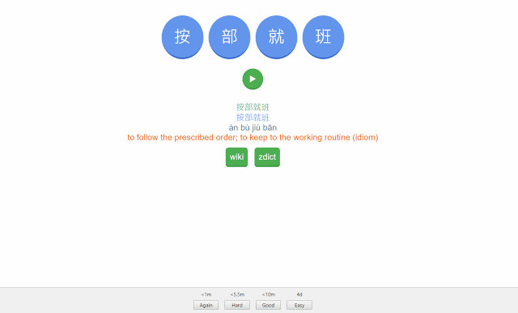

# chinese-chengyu

Excerpt from Wikipedia<br>
`Chengyu (traditional Chinese: 成語; simplified Chinese: 成语; pinyin: chéngyǔ; lit. '[already] made/formed words/speech') are a type of traditional Chinese idiomatic expression, most of which consist of four characters. Chengyu were widely used in Classical Chinese and are still common in vernacular Chinese writing and in the spoken language today.`

<br>

# QuickStart 
Download chengyu Anki decks from AnkiWeb
[chengyu Anki decks](https://ankiweb.net/shared/info/1956974465)

# Features in the Anki deck
- Gamification, select chengyu characters in order 
- Simplified, Traditional, Pinyin and Audio
- View Wikipedia data related to Chenyu 
- View Meaning in zdict 
- Meaning taken from CC-CEDICT

# To create this deck
1. Create a new deck in Anki
2. Add five fields 
    ```
    chengyu_sim
    chengyu_trad
    Pinyin
    Meaning
    Audio
    ```
3. Download chengyu list and import in Anki and map the fields
<br>View [chengyu list](versions/v1.0/chengyu.txt)

4. Copy front.html to front side of deck template
<br>View [front.html](versions/v1.0/front.html)

5. Copy back.html to back side of deck template
<br>View [back.html](versions/v1.0/back.html)

6. Copy card.css to styling of deck template 
<br>View [card.css](versions/v1.0/card.css)

# Demo


# License
Mani <br>
CC-BY-SA 4.0